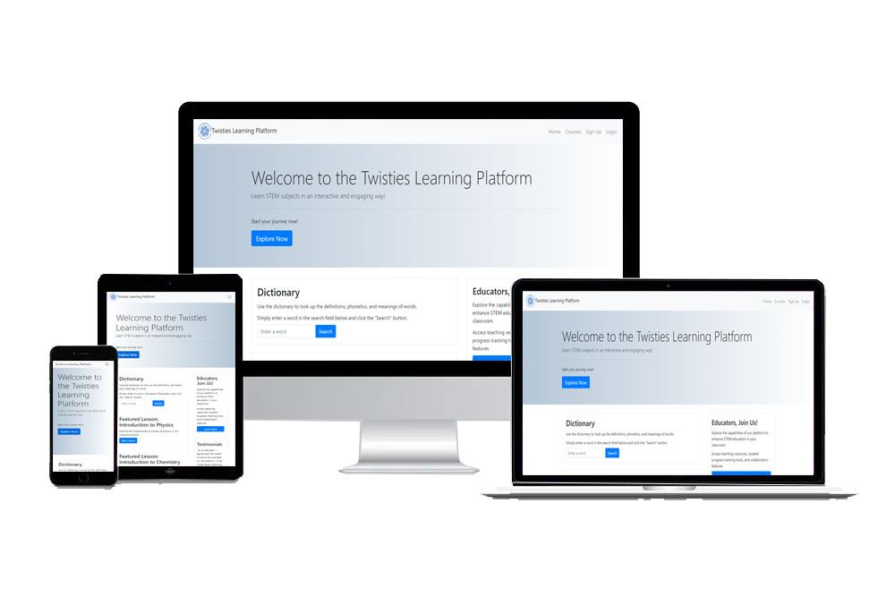

# Twisties Learning Platform

Twisties Learning Platform is a dynamic solution that provides STEM education through its interactive and immersive approach. It offers an interactive STEM educational experience, seamlessly blending interactive technology with a comprehensive STEM curriculum to empower learners of all ages and backgrounds. The website has a responsive interface that adapts seamlessly to any device. Our goal goes beyond mere instruction – we aim to inspire engagement at every turn. 

# Table of Contents

1. [Requirements](#requirements)
2. [Design](#product-design)
3. [Development](#installation)
4. [Testing](#testing)
5. [Credits](#credit)
6. [License](#license)

## Requirements

## 1. Home Page
- **Dictionary**: Display a dictionary feature prominently on the home page, allowing users to explore and search for definitions of STEM- terms.
- **Featured Lessons**: Showcase featured lessons or courses on the home page to grab user's attention and encourage exploration.
- **Testimonials**: Include a section for user testimonials to build credibility and trust.

## 2. Educator Section
- **Call to Action**: Implement a section specifically targeting educators, inviting them to join the platform.
- **Sign Up & Login**: Provide options for educators to sign up or log in to access additional features or instructor tools.

## 3. Courses Page
- **Available Courses**: Present a list of available courses on the platform, categorized by subject or topic.
- **Course Content**: For each course, detail the content structure.
- **Video Tutorials**: Include video tutorials for each lesson within the course content, providing interactive learning experiences.

## 4. Quiz Feature
- **End-of-Course Quiz**: After completing each course, users are prompted to take a quiz to test their understanding of the material.
- **Score Display**: Upon completion of the quiz, users should see their quiz scores.

## General Requirements
- **Responsive Design**: Ensure the platform is responsive and accessible across various devices and screen sizes.
- **Progress Tracking**: Enable users to track their progress within each course.

