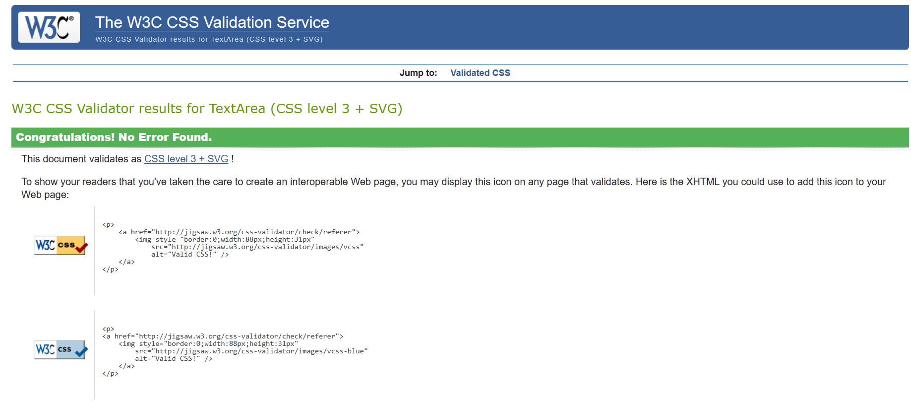

# Twisties Learning Platform
### Learn STEM subjects in an interactive and engaging way!

Twisties Learning Platform offers a dynamic and immersive STEM education experience that empowers learners of all ages and backgrounds. By seamlessly blending interactive technology with a comprehensive STEM curriculum, we provide a platform where users can engage with hands-on learning activities, access high-quality educational content, and track their progress. Our responsive interface ensures accessibility across various devices, while our commitment to inspiring engagement and fostering a lifelong love for learning sets us apart. Whether you're a student seeking to expand your knowledge or an educator looking to enhance your teaching resources, Twisties Learning Platform is your gateway to limitless learning opportunities in science, technology, engineering, and mathematics. 

# Table of Contents

1. [Requirements](#requirements)
2. [Usecase](#usecase)
3. [Design](#product-design)
4. [Development](#development)
5. [Testing](#testing)
6. [Deployment](#deployment)
7. [Credits](#credits)
8. [License](#license)

## REQUIREMENTS

### Home Page
- **Dictionary**: Display a dictionary feature prominently on the home page, allowing users to explore and search for definitions of STEM- terms.
- **Featured Lessons**: Showcase featured lessons or courses on the home page to grab user's attention and encourage exploration.
- **Testimonials**: Include a section for user testimonials to build credibility and trust.

### Educator Section
- **Call to Action**: Implement a section explicitly targeting educators, inviting them to join the platform.
- **Sign Up & Login**: Provide options for educators to sign up or log in to access additional features or instructor tools.

### Courses Page
- **Available Courses**: Present a list of available courses on the platform, categorised by subject or topic.
- **Course Content**: Detail the content structure for each course.
- **Video Tutorials**: Include video tutorials for each lesson within the course content, providing interactive learning experiences.

### Quiz Feature
- **End-of-Course Quiz**: After completing each course, users are prompted to take a quiz to test their understanding of the material.
- **Score Display**: Users should see their quiz scores upon completion.

### General Requirements
- **Responsive Design**: Ensure the platform is responsive and accessible across various devices and screen sizes.
- **Progress Tracking**: Enable users to track their progress within each course.

## USECASE

### Actors:
- **User**: A person interested in learning STEM subjects.

### Main Flow:
1. **User Navigation**:
   - The user navigates to the Twisties Learning Platform website.
   - The home page loads and displays various sections, including a navigation bar, dictionary, featured lessons, and testimonials.

2. **Exploring Available Courses**:
   - The user clicks the "Courses" link from the navigation menu.
   - The user sees a list of available STEM courses categorised by subject or topic.

3. **Selecting a Course**:
   - The user browses through the list of courses and selects one that interests them.

4. **Viewing Course Details**:
   - The user is directed to the course details page, which includes the course content and video tutorials.

6. **Accessing Course Content**:
   - The user starts with the first lesson and progresses through the lessons.

7. **Watching Video Tutorials**:
   - Within each lesson selected from the list, the user watches video tutorials explaining the concepts and demonstrating examples of the topic.

8. **Taking End-of-Course Quiz**:
   - Upon completing all the lessons in the course, the user is prompted to take an end-of-course quiz to test their understanding.
   - The user answers the quiz questions and submits their responses.

9. **Viewing Quiz Results**:
   - After submitting the quiz, the platform displays the user's scores.
   - If the user scores below a certain mark, the user is allowed to Try again.
   - if the user scores above a certain mark, the user is congratulated and redirected to the courses page and may choose to revisit specific lessons for further study.

## DESIGN

### Low-Fidelity Prototype
This is the foundational blueprint for Twisties' learning Platform design and layout. It outlines the structural framework of the site, depicting the arrangement of key elements such as navigation menus, content sections, and interactive features.

### Justification for Color Scheme
The choice of a blue, grey, and white colour scheme for the Twisties Learning Platform is deliberate and serves several purposes:

1. **Professionalism and Trustworthiness**: Blue is often associated with professionalism, trustworthiness, and reliability. By incorporating blue into the colour scheme, the platform communicates a sense of credibility and authority in providing STEM education.

2. **Calmness and Serenity**: Blue is also known for its calming and serene qualities. In an educational context, where users may seek knowledge and focus, blue can help create a tranquil and conducive learning environment.

3. **Neutrality and Balance**: Grey is a neutral colour that complements blue well. It provides a sense of balance and stability to the colour scheme, preventing it from feeling overwhelming or overly vibrant. Grey can also convey sophistication and modernity.

4. **Cleanliness and Simplicity**: White is often associated with cleanliness, simplicity, and purity. By incorporating white into the colour scheme, the platform achieves a clean and minimalist aesthetic, which can enhance readability and user experience.

5. **Accessibility and Readability**: Blue and grey are typically high-contrast colours paired with white, improving accessibility and readability, particularly for text and interactive elements.
[Back to Top](#requirements)

## DEVELOPMENT

The Waterfall Iterative Development Life Cycle (WIDLC) methodology was selected to develop the Twisties Learning Platform. The WIDLC methodology follows a sequential, step-by-step process, with each phase building upon the results of the previous phase. However, it incorporates iterative elements, allowing for feedback and adjustments throughout the development lifecycle. It offered a structured approach to developing the Twisties Learning Platform, allowing for thorough planning, design, implementation, testing, deployment, and maintenance.  This methodology was selected because the project requirements were well-defined, stable, and unlikely to change significantly throughout development.

## Implementation

HTML, CSS, jQuery and Bootstrap were used extensively in the development of the Twisties Learning Platform to create a visually appealing and user-friendly interface. HTML was used to structure the platform's content, defining the layout and elements such as headings, paragraphs, buttons, and forms. CSS was utilised to style the HTML elements, including fonts, colours, spacing, and layout, ensuring a cohesive and consistent design across all pages. Bootstrap, a popular front-end framework, played a crucial role in the implementation by providing pre-designed components and utilities for responsive and mobile-first development. Bootstrap's grid system facilitated the creation of responsive layouts, ensuring the platform is accessible and optimised for various screen sizes and devices. Additionally, Bootstrap's predefined CSS classes were utilised to enhance the visual appearance of navigation bars, buttons, cards, and modals, contributing to a polished and professional user experience.JavaScript played an instrumental role in adding interactivity and functionality to the platform. JavaScript was used to implement dynamic behaviour, such as form validation, DOM manipulation, event handling, and modal popups. Together, these technologies enabled the creation of a seamless learning environment, allowing users to explore courses, search for definitions, view testimonials, and interact with educational content effortlessly. The integration of HTML, CSS, JavaScript, jQuery, and Bootstrap resulted in a cohesive and user-friendly platform that meets the needs of learners and educators alike.

## Features & Functions Implemented

### Dictionary Functionality
- The `searchWord()` function fetches dictionary data from an API based on user input and displays the results in a modal dialogue.
- Fetched data is rendered using the `displayDictionaryResultsInModal()` function.

### Form Validation
- Two functions, `validateLogin()` and `validateForm()`, handle form validation.
- `validateLogin()` alerts users about the unavailability of login functionality.

- `validateForm()` checks email format and password complexity using regular expressions.

### URL Parameters
- URL parameters are utilised to extract the course name and pass it along for various operations, such as fetching course content and setting up quiz links.
- Based on the query parameter `course`, the script populates course content dynamically.
- Each course has a list of topics with corresponding video links, populated based on the selected course.

### Video Loading and Marking as Watched
- On page load, the initial video for the selected course is loaded automatically.
- Users can click on course topics to load corresponding videos.
- Watched videos are marked, triggering a completion modal once all videos are watched. The modal congratulates the user and provides a link to a course-related quiz.

### Completion Modal
- The completion modal dynamically updates the course title each time it's displayed.
- It also provides a link to take a quiz related to the course.

### Event Listeners and jQuery Usage
- Event listeners handle user interactions, such as clicking on course topics or the "Take Quiz" button.
- jQuery is used for functionalities like dynamically setting the course title in the completion modal.

## Quiz Implementation Details

### Retrieving URL Parameters
A JavaScript function `getParameterByName(name, url)` is implemented to retrieve the value of a URL parameter by name. It uses regular expressions to parse the URL and extract the desired parameter.

### Dynamically Populating Quiz Forms
- Separate functions are defined for each subject (e.g., `populatePhysicsQuestions()`, `populateChemistryQuestions()`).
- Each function dynamically generates HTML content for the quiz form with radio button options for multiple-choice questions.
- The HTML content is inserted into the designated quiz form element in the DOM (`

`).

### Switch Case for Subject Selection
- After retrieving the subject title from the URL parameter, a switch case statement determines which subject's quiz questions to populate.
- Based on the subject title, the corresponding function to populate quiz questions is called.

### Sample Quiz Questions
The image below shows a sample of the quiz page.

### 404 Redirect
The code was writen such that users who direct to a non-existent page or resource are redirected back to the main page without having to use browser navigation buttons. The script below was added to the `404.html` page.

[Back to Top](#requirements)

## TESTING

### Usability Testing
The site demonstrates adherence to Norman and Nielsen's design principles of:

1. **Visibility**:
   - The navigation bar at the top of the page is visible and provides immediate access to essential sections like Home, Courses, Sign Up, and Login.
   - Using contrasting colours for buttons and links makes them easily distinguishable from other page elements, enhancing their visibility.
   

2. **Feedback**:
   - Interactive elements, such as buttons, modals, alerts and links, provide immediate visual feedback upon interaction, such as changing colour or appearance.
   - The use of hover effects on cards provides feedback to users when they hover over them, indicating that they are clickable.
   - The mouse pointer changes when you hover a clickable element on the website.
   

3. **Affordance**:
   - Buttons and links are styled to look clickable, indicating their function and encouraging user interaction.
   - The search input field and button in the dictionary section afford the action of searching for a word, clearly indicating its purpose.

4. **Consistency**:
   - The layout and design elements, such as typography, colours, and spacing, are consistent throughout the website, providing a cohesive user experience.
   - Navigation elements, like the navbar and buttons, maintain consistent styling across different sections of the website.

5. **Error Prevention and Recovery**:
   -Form inputs are validated before submission to prevent user errors and provide clear error messages and guidance for users in case of input mistakes.
    

6. **Flexibility and Efficiency of Use**:
   - The layout is designed to be responsive, ensuring that the website is usable across various devices and screen sizes, thus accommodating a wide range of users efficiently.
    
    

7. **Aesthetic and Minimalist Design**:
   - A clean and minimalist design approach, evident in the consistent layout, typography, and white space, contributes to an aesthetically pleasing user interface.

### Functional Testing (Manual Test Result)
**Home Page**
1. **Dictionary**:
   - [x] Verify that the dictionary feature is prominently displayed on the Home page. (Pass)
   - [x] Test search functionality with different STEM terms. (Pass)

2. **Featured Lessons**:
   - [x] Check that featured lessons are showcased. (Pass)
   - [x] Click to ensure redirection to course pages. (Pass)

3. **Testimonials**:
   - [x] Confirm the presence of testimonials. (Pass)

**Educator Section**
1. **Call to Action**:
   - [x] Ensure the educator section is visible on the home page. (Pass)
   - [x] Test that sign up and log in are visible (Pass)

2. **Sign Up & Login**:
   - [x] Test educator sign-up process. (Pass Validation/ Process incomplete (No database))
   - [x] Verify login functionality. (Pass Visibility/process incomplete (No database))

**Courses Page**
1. **Available Courses**:
   - [x] Check list of courses and categories. (Pass)
   - [x] Ensure redirection to course details. (Pass)

2. **Course Content**:
   - [x] Verify that the course structure is clear. (Pass)
   - [x] Test navigation between sections. (Pass)

3. **Video Tutorials**:
   - [x] Ensure videos play correctly. (Pass)
   - [x] Test pause, play and volume controls. (Pass)

**Quiz Feature**
1. **End-of-Course Quiz**:
   - [x] Confirm prompt after course completion. (Pass)
   - [x] Test the relevance of quiz questions. (Pass)

2. **Score Display**:
   - [x] Verify immediate score display. (Pass)
   - [x] Check feedback on answers. (Fail: Does not display correct answers because it was not implemented)

**General Requirements**
1. **Responsive Design**:
   - [x] Test on various devices. (Pass)
   - [x] Check for layout issues. (Pass)

2. **Progress Tracking**:
   - [x] Test progress indicators. (Pass)
   

### Testing HTML with W3C Markup Validation Service

**Accessing the Validator:**- Navigate to the [W3C Markup Validation Service/Jigsaw](https://validator.w3.org/)(https://jigsaw.w3.org/css-validator/validator).

**Uploading HTML File or Entering URL:**- Paste the HTML file directly or enter the webpage URL to be validated.

**Initiating Validation:**- Click on the "Check" or "Validate" button to start the validation process.

**Reviewing Results:**
  - The validator will analyse the HTML document and provide a detailed report of errors, warnings, or suggestions.
  - Errors indicate serious issues that need immediate attention.
  - Warnings highlight potential problems that may impact usability or accessibility.
  - Suggestions offer recommendations to improve the code structure or adherence to best practices.

**Addressing Issues:**
- Review each reported issue and make necessary corrections to the HTML code.
- Revalidate the document after errors are fixed to ensure compliance.

**Images Showing some validation Results HTML/CSS**

## Solution for the above

## Other Errors

### Testing JavaScript on JsLint (Test Result)

## DEPLOYMENT
The website was deployed on Git pages with the following steps (Assuming you are already logged in to GitHub)
 - Go to Twisties learning platform repository on GitHub
 - Ensure the repository contains the necessary files for the Twisties learning platform, including an `index.html` file as the entry point.
 - Ensured additional assets like CSS, JavaScript, and images were present in the Repo.
 - Click on the "Settings" tab on the Twisties Learning platform repository.
 - Scroll down to the "GitHub Pages" section.
 - Under "Source", select the branch that contains Twisties learning platform code. 
 - Click on "Save".
 - After enabling GitHub Pages, GitHub provided a URL where the site was published (https://twisty147.github.io/TwistiesLearningPlatform/).
 - If you have a custom domain, configure it in the "Custom domain" field in the GitHub Pages settings. You'll need to set up DNS records accordingly.
[Back to Top](#requirements)

## CREDITS

### Code Credits

- **Code Institute**: Acknowledgement for the training and utilization of `Code-Institute-Org/ci-full-template`.
- **Stack Overflow**: Recognized for providing invaluable assistance during troubleshooting sessions, offering insights on bug fixes.
- **DictionaryAPI.dev**: Utilized the free dictionary API integrated into the homepage `https://dictionaryapi.dev/`.
- **Tutorial on Animating Gradients with Pure CSS**: Leveraged for learning how to animate gradients for the `.jumbotron` class on the homepage and educators page. Inspiration was drawn from this tutorial, with no direct code replication `https://dev.to/gmeben/animating-gradients-with-pure-css-3bi8`.
- **Tutorial on Getting URL Parameters Using JavaScript**: Incorporated guidance from this tutorial for handling URL parameters `https://www.geeksforgeeks.org/how-to-get-url-parameters-using-javascript`.
- **CSS Transition and Transformation Tutorial**: Inspired the implementation of CSS transition and transformation for the card behaviors on the Twisties Learning Platform. No code was directly extracted from this source  `https://www.w3schools.com/css/css3_2dtransforms.asp `.
- **Bootstrap Documentation for Watched List Items Styles**: Utilized the styles provided in the Bootstrap documentation for creating watched list items `https://getbootstrap.com/docs/5.0/components/list-group/`.
- **HTML Script Injection Tutorial**: Consulted for guidance on injecting HTML from JavaScript into the project `https://www.w3schools.com/html/html_scripts.asp`.

### Video-Credits
- **Introduction to Physics Video**: https://youtu.be/b1t41Q3xRM8
- **Mechnics Video**:https://youtu.be/aD58U3Ib0ng
- **Themodynamics Video**:https://youtu.be/NyOYW07-L5g
- **Electricity and Magnetism Video**:https://youtu.be/79_SF5AZtzo
- **Optics video**:https://youtu.be/Oh4m8Ees-3Q
- **Introduction to Chemistry**: https://youtu.be/bka20Q9TN6M
- **Acid and Bases**:https://youtu.be/vt8fB3MFzLk
- **The periodic table**:https://youtu.be/0RRVV4Diomg
- **Chemical bonds**:https://youtu.be/AE5QcL4VfH4
- **Organic chemistry**:https://youtu.be/PmvLB5dIEp8
- **Introduction to Biology**: https://youtu.be/DTnCqBUnaRM
- **Cell biology**:https://youtu.be/vt8fB3MFzLk
- **Ecology**:https://youtu.be/t5DvF5OVr1Y
- **Evolution**:https://youtu.be/GcjgWov7mTM
- **Human anatomy**:https://youtu.be/gEUu-A2wfSE
- **Introduction to Computer**: https://youtu.be/qfUZBKDh9BY
- **Operating System**:https://youtu.be/26QPDBe-NB8
- **Hardware**:https://youtu.be/8_itvuz5Dc4
- **Software**:https://youtu.be/PBDlbSAddAI
- **Desktop Publishing**:https://youtu.be/J-3-IMlriW0
- **Introduction to Economics**: https://youtu.be/3ez10ADR_gM
- **Demand**:https://youtu.be/LwLh6ax0zTE
- **Supply**:https://youtu.be/ewPNugIqCUM
- **Trade**:https://youtu.be/dmqoqVwFopE
- **Taxation**:https://youtu.be/7Qtr_vA3Prw
- **Introduction to Civil Engineering**: https://youtu.be/LCyZFTEyNoo
- **Building Materials**:https://youtu.be/a1cQcIJfjPw
- **Construction**:https://youtu.be/mbwuj58UEPg
- **Surveying**:https://youtu.be/VD1ltgO_iaw
- **Engineering Technology**:https://youtu.be/5zDcHJn4oj0

### Image-Credits
- **Chemistry-Course**: https://encrypted-tbn3.gstatic.com/images?q=tbn:ANd9GcTCpqjYfnERcAZCS_kHZyfyIXhutGCZo37zoxPlhvU9VjmmO32I
- **Physics-Course**: https://bike.bikegremlin.com/3447/theory_vs_practice/
- **Computer-Course**:https://cornershopcreative.com/blog/getting-started-accessibility/
- **Economics-Course**: https://encrypted-tbn2.gstatic.com/images?q=tbn:ANd9GcTXzSJC2iodq76AcbhPjeguB1qE1PRU_lAAkHhvVJPC0a2AkSu1
- **Civil-Engineering-Course**: https://encrypted-tbn3.gstatic.com/images?q=tbn:ANd9GcSTerS7gmhN9LHPiqBeGKmeZ-Cwx-m9vvHENdbtQJOTvyzQRH4e

# License

Copyright (c) 2024 Oliver Amah

Permission is hereby granted, free of charge, to any person obtaining a copy
of this website without restriction, including without limitation the rights
to use, copy, modify, merge, publish, distribute, copies of the website, 
and to permit persons to whom the website is
furnished to do so, subject to the following conditions:

The above copyright notice and this permission notice shall be included in all
copies or substantial portions of the website.

IN NO EVENT SHALL THE AUTHOR BE LIABLE FOR ANY CLAIM, DAMAGES OR OTHER
LIABILITY, WHETHER IN AN ACTION OF CONTRACT, TORT OR OTHERWISE, ARISING FROM,
OUT OF OR IN CONNECTION WITH THE Website.
[Back to Top](#requirements)